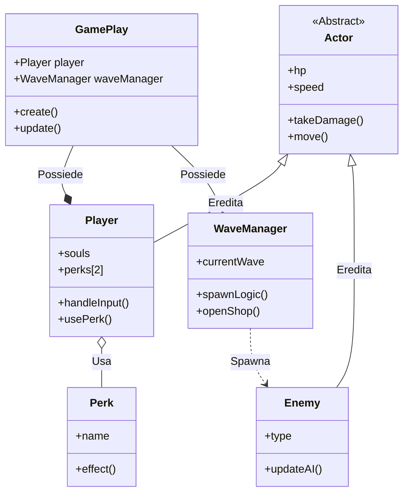

# Diagramma delle Classi Semplificato: (RE)VOLUTION

Questo diagramma riduce la complessità per rendere lo sviluppo immediato, intuitivo e ideale per la collaborazione con l'AI.

## 📊 Schema Classi

---

## 📂 Descrizione delle Classi e Relazioni

### 1. **GamePlay (La Scena)**
È il punto di ingresso. Collega il giocatore e la logica delle ondate.
*   **Relazione**: "Possiede" le istanze di Player e WaveManager. È il "collante" del gioco.

### 2. **Actor (Classe Base)**
Definisce le proprietà fisiche comuni: punti vita (HP), movimento e ricezione danni.
*   **Relazione**: È la classe genitore (**Ereditarietà**) di Player e Enemy. Evita la duplicazione di codice fondamentale.

### 3. **Player (Il Protagonista)**
Gestisce l'input del giocatore, la raccolta delle anime e l'attivazione dei Perk.
*   **Relazione**: "Usa" oggetti di tipo Perk. È il centro dell'azione.

### 4. **Enemy (Il Bestiario)**
Gestisce i diversi comportamenti dei nemici (distanza per il Demone, carica per lo Scheletro).
*   **Sviluppo AI**: È facile chiedere all'AI di "aggiungere un nuovo tipo di comportamento in Enemy" senza influenzare il movimento del Player.

### 5. **WaveManager (Progressione)**
Controlla il flusso del gioco: inizio ondata, spawn dei nemici e passaggio alla fase di Shop.
*   **Relazione**: Crea i nemici e monitora lo stato della partita.

### 6. **Perk (Abilità Speciali)**
Classi piccole e mirate per Scatto, Cura, ecc.
*   **Modularità**: Ogni Perk può essere un file separato, permettendo a più persone di crearne di nuovi senza generare conflitti nel codice.

---

## 🚀 Vantaggi della Semplificazione
*   **Intuitività**: La gerarchia è piatta e facile da seguire per un nuovo programmatore.
*   **AI-Ready**: Ogni classe ha un compito così specifico che l'AI può generare intere funzioni con un prompt minimo.
*   **Velocità**: Meno classi significa meno "collegamenti" da gestire manualmente, accelerando la creazione del prototipo.
