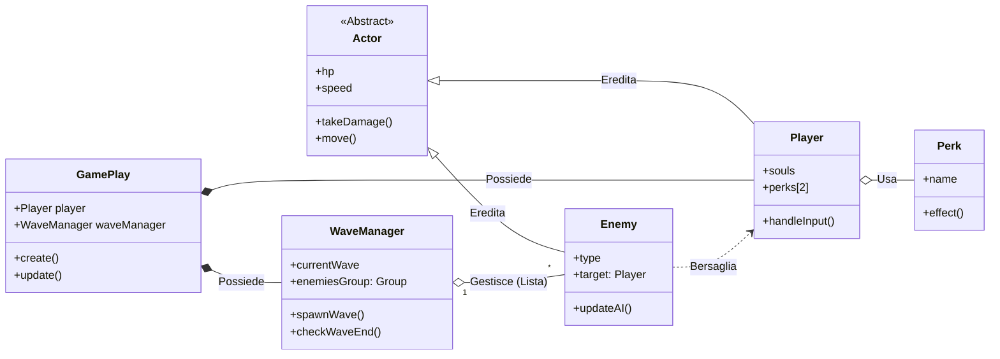

# Diagramma delle Classi Semplificato: (RE)VOLUTION

Questo diagramma è ottimizzato per la visualizzazione su GitHub (Mermaid), minimizzando le sovrapposizioni delle frecce e rendendo chiari i compiti del team e dell'AI.

## 📊 Schema Classi (Ottimizzato per GitHub)

---

## 📂 Descrizione delle Classi e Relazioni

### 1. **GamePlay (La Scena)**
È il "Main" del gioco. Inizializza il giocatore e il gestore delle ondate.
*   **Relazione**: Possiede le istanze principali. Se vuoi cambiare come inizia il gioco, lavora qui.

### 2. **Actor (Classe Base)**
Definisce cosa significa essere un'entità fisica nel gioco (vita, movimento).
*   **Relazione**: È il genitore di Player ed Enemy. **Vantaggio AI**: Puoi chiedere all'AI di modificare la logica di ricezione danni per tutti gli attori in un colpo solo.

### 3. **Player (Il Protagonista)**
Gestisce gli input e il progresso economico (anime).
*   **Relazione**: Utilizza i Perk. È il centro dell'azione e il bersaglio dei nemici.

### 4. **Enemy (Logica dei Mostri)**
Contiene i pattern di attacco. 
*   **Relazione**: Ogni istanza punta al Player per sapere dove muoversi.
*   **Sviluppo a più mani**: Un programmatore può creare nuovi tipi di AI qui senza toccare il resto del codice.

### 5. **WaveManager (Il Regista)**
Controlla il flusso delle ondate e lo spawn dei nemici.
*   **Relazione**: Gestisce la "collezione" di nemici vivi. È il ponte tra il combattimento e la fase Shop.

### 6. **Perk (Abilità Modulari)**
Ogni Perk è una classe a sé stante.
*   **Vantaggio AI**: Fornisci all'AI lo schema di un Perk e chiedile di generarne 10 diversi (Scatto, Scudo, Esplosione). È il modo più sicuro per espandere il gioco senza bug.

---

## 🚀 Note per la Visualizzazione
Il diagramma utilizza la direzione **LR (Left-to-Right)** per evitare che le frecce di ereditarietà e possesso si incrocino eccessivamente, migliorando la resa grafica nell'anteprima di GitHub.
