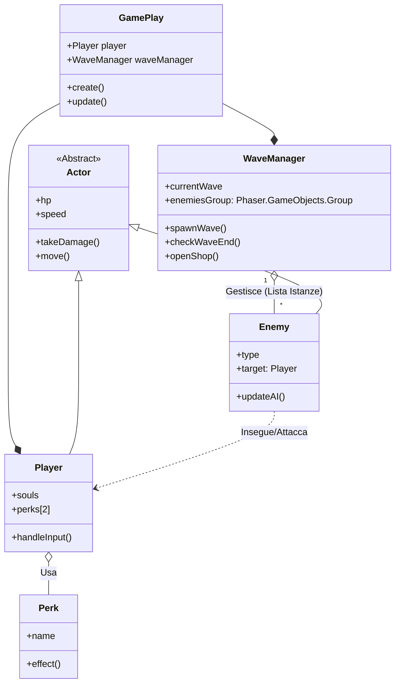

# Diagramma delle Classi Semplificato: (RE)VOLUTION

Questo diagramma è ottimizzato per dividere la gestione dei flussi di gioco (Ondate) dalla logica individuale dei personaggi (AI), facilitando lo sviluppo parallelo e l'uso dell'AI.

## 📊 Schema Classi
Freccia vuota = EREDITA
Rombo pieno = POSSIEDE

---

## 📂 Descrizione delle Classi e Relazioni Migliorate

### 1. **WaveManager (Il Regista)**
Gestisce il ciclo di vita dell'ondata. 
*   **Relazione**: Possiede il riferimento a tutti i nemici vivi tramite `enemiesGroup`.
*   **Compito**: Decide *quando* e *quanti* nemici creare. Quando il gruppo è vuoto, attiva la fase Shop.

### 2. **Enemy (La Logica Individuale)**
Ogni nemico è un'entità autonoma.
*   **Relazione**: Riceve il `Player` come bersaglio (target) per poterlo inseguire.
*   **Compito**: La funzione `updateAI()` contiene il comportamento specifico (es. lo Scheletro che carica o il Demone che mantiene la distanza). 
*   **Vantaggio AI**: Puoi chiedere all'AI di riscrivere solo `updateAI()` per creare nuovi pattern di attacco senza rischiare di rompere il sistema delle ondate.

### 3. **Actor (La Base Fisica)**
Classe astratta che gestisce ciò che è comune (vita, movimento base, collisioni).
*   **Ereditarietà**: Sia `Player` che `Enemy` sono `Actor`.

### 4. **Player (Il Protagonista)**
Gestisce l'input e l'uso dei Perk.
*   **Relazione**: Viene "puntato" dai nemici e "usa" i Perk acquistati.

### 5. **Perk (Abilità Modulari)**
Abilità esterne che modificano il comportamento del Player.
*   **Modularità**: Essendo classi separate, l'AI può generare infiniti perk senza conoscere la logica complessa del gioco.

---

## 🚀 Perché questa struttura è migliore?
1.  **Separazione delle Responsabilità**: Il `WaveManager` non deve sapere *come* attacca un nemico, deve solo sapere *quanti* ne sono rimasti.
2.  **Targeting Chiaro**: I nemici hanno una relazione diretta con il Player (`Enemy ..> Player`), rendendo la logica di inseguimento semplice da scrivere.
3.  **Collaborazione**: Uno sviluppatore può lavorare sulla difficoltà delle ondate (`WaveManager`) mentre un altro lavora sui tipi di mostri (`Enemy`) senza sovrapporsi.
