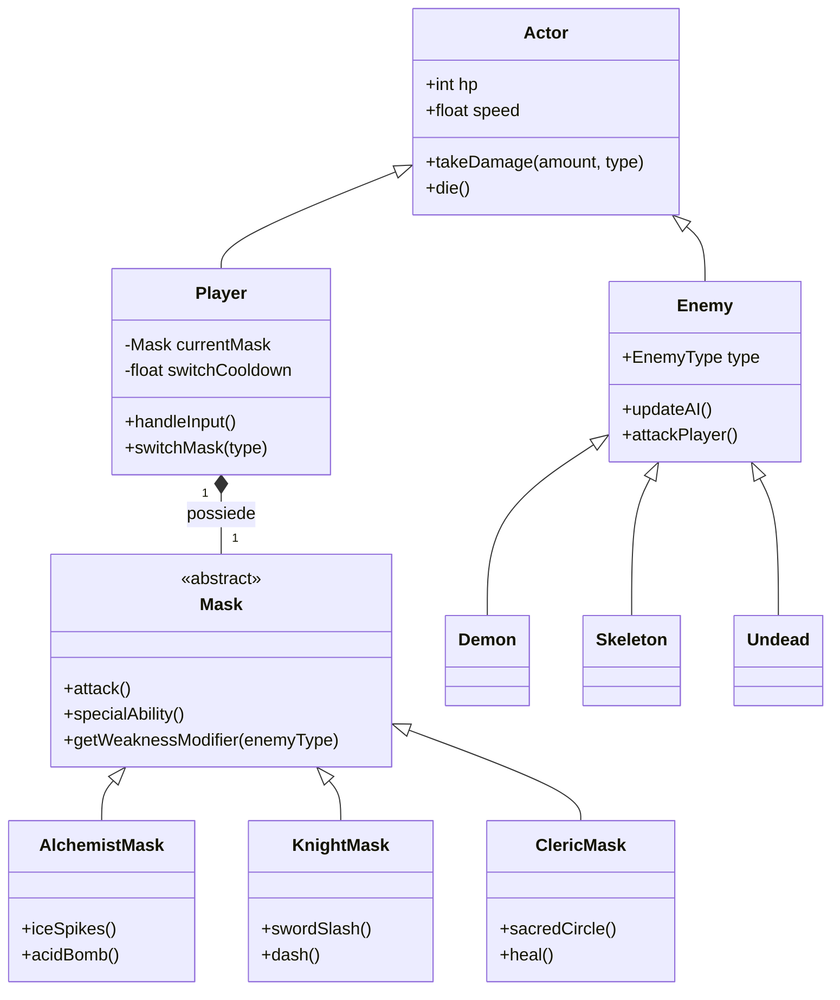

# Diagramma delle Classi - (RE)VOLUTION

Il progetto segue un'architettura orientata agli oggetti e ai componenti, ottimizzata per Phaser 3, dove il giocatore cambia il proprio set di abilità scambiando l'oggetto "Mask" attivo.

## Struttura dei File (Directory `src/`)

```text
src/
├── GameData.ts           # Costanti, tipi di danno e configurazione asset
├── gameComponents/
│   ├── Actor.ts          # Classe base per entità con HP e fisica (Player, Enemy)
│   ├── Player.ts         # Gestione movimento e switch delle maschere
│   ├── Enemy.ts          # Classe base per l'IA dei nemici
│   ├── Projectile.ts     # Gestione proiettili (Spuntoni, Bombe acide)
│   ├── masks/
│   │   ├── Mask.ts       # Classe base astratta per le maschere
│   │   ├── Alchemist.ts  # Logica: Ghiaccio e Acido (efficace vs Demoni)
│   │   ├── Knight.ts     # Logica: Spada e Carica (efficace vs Scheletri)
│   │   └── Cleric.ts     # Logica: Cerchio Sacro e Cura (efficace vs Non Morti)
│   └── enemies/
│       ├── Demon.ts      # Nemico vulnerabile all'Alchimista
│       ├── Skeleton.ts   # Nemico vulnerabile al Cavaliere
│       └── Undead.ts     # Nemico vulnerabile al Chierico
└── scenes/
    ├── Intro.ts          # Cutscene narrativa (Lettera/Re/Diavolo)
    ├── GamePlay.ts       # Loop principale, gestione orde e spawn
    └── Hud.ts            # UI per HP, cooldown maschere e timer orde
```

## Diagramma delle Classi (Mermaid)



## Relazioni e Logica Core

### 1. Sistema delle Maschere (Strategy Pattern)
Invece di avere tre classi Player diverse, la classe `Player` contiene un riferimento a una `Mask`. Quando il giocatore cambia maschera:
- Vengono aggiornati i metodi `attack()` e `specialAbility()`.
- Cambia l'estetica del personaggio (sprite/animazione).
- Viene applicato un cooldown globale allo switch per evitare abusi.

### 2. Gestione Debolezze
Ogni `Enemy` ha un attributo `type`. La `Mask` attiva calcola il danno in base a questa proprietà:
- **Alchimista**: Danno x2 contro i **Demoni**.
- **Cavaliere**: Danno x2 contro gli **Scheletri**.
- **Chierico**: Danno x2 contro i **Non Morti**.

### 3. Scene e Flusso
- **Intro**: Gestisce la sequenza di immagini descritta nel concept (Lettera -> Re -> Diavolo) con il supporto del narratore AI.
- **GamePlay**: Utilizza una **Tilemap** delle catacombe di Parigi. Gestisce lo spawning delle orde in modo progressivo (stile survival).
- **Hud**: Visualizza lo stato della maschera attuale e il tempo rimanente alla prossima ondata.
